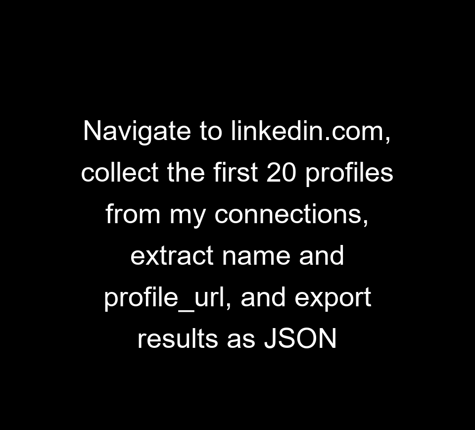

# 🔍 LinkedIn-Scraper

This project uses `browser-use` — an LLM-powered browser automation library — to scrape LinkedIn connections and extract structured profile data such as names and URLs. It combines browser control, language models, memory handling, and persistent sessions to collect data from dynamically rendered web pages.

---

## ⚙️ Technical Specs

### 🧠 High-Level Design

- **Agent-Based Automation**: Uses a custom agent (`ContextManagedAgent`) built on `browser-use` to navigate LinkedIn and interact with dynamic content.
- **LLM-Powered**: Integrates Google Gemini via `langchain_google_genai` for reasoning and deciding browser actions.
- **Memory Management**: Implements a `ConversationTokenBufferMemory` to limit context to 3000 tokens.
- **DOM Filtering**: Truncates DOM to focus on interactive elements (like `button`, `a`, and `input`) for LLM efficiency.
- **Caching**: Employs `PersistentBrowser` to retain browser sessions for faster repeat runs and bypass login flow.
- **Context Resetting**: Reloads the page and resets memory every 5 steps to avoid model confusion due to stale context.
- **Loop Prevention**: Limits agent steps and tracks identical actions to avoid infinite loops.

### 📚 Libraries Used

- `browser-use`
- `langchain`
- `langchain-google-genai`
- `pydantic`
- `python-dotenv`
- `asyncio`, `re`, `json`, `os`

---

## 🚀 Setup & Usage

### 1️⃣ Clone the Repo

```bash
git clone https://github.com/Sahilkumar19/LinkedIn-Scraper.git
cd LinkedIn-Scraper
```

### 2️⃣ Setup Python Environment using `uv`

Make sure you have [uv](https://github.com/astral-sh/uv) installed.

```bash
uv venv --python 3.11
```

#### Activate the Environment

```bash
# For Mac/Linux:
source .venv/bin/activate

# For Windows:
.venv\Scripts\activate
```

### 3️⃣ Install Dependencies

```bash
uv pip install -r requirements.txt
```

### 4️⃣ Add Your Credentials

Create a `.env` file in the project root with the following:

```env
GEMINI_API_KEY=your_google_generative_ai_key
```

### 5️⃣ Run the Scraper

```bash
python agent.py
```

### 🧪 Example Output

After running the script, you'll get a `linkedin_connections.json` file like:

```json
[
  {
    "name": "user1",
    "profile_url": "https://www.linkedin.com/in/user-1/"
  },
  {
    "name": "user2",
    "profile_url": "https://www.linkedin.com/in/user-2/"
  }
]
```

---

## 💡 Discussion

### 🧱 Challenges Faced

- **LinkedIn Anti-Scraping**: LinkedIn uses bot-detection techniques and requires login. Solved this by connecting to my existing Chrome installation to access saved states and cookies.
- **OpenAI API Key Limits**: The agent was unable to complete a single task using the free tier of the OpenAI API. Therefore, I switched to Google's Gemini API, which is free to use and provided better performance for this project.
- **Dynamic Content Loading**: LinkedIn loads data asynchronously, so we added `wait_for_network_idle_page_load_time` to ensure full page load before DOM interaction.
- **Context Limitations**: LLMs have limited memory. We truncated the DOM to the most relevant interactive elements and reset memory every 5 steps.
- **Loop Prevention**: Set max iteration safeguards and tracked redundant actions to detect when the agent gets stuck.
- **Headless vs Headed Mode**: During debugging, headed mode (`highlight_elements=True`) helped visualize the agent’s behavior.

### ✅ Optimizations Implemented

- Used `ConversationTokenBufferMemory` to retain relevant info within the token budget.
- Filtered irrelevant DOM nodes to reduce context bloat.
- Cached browser sessions to reduce login frequency.
- Reloaded stale pages and context periodically.

---

## 📂 Output & Caching

- Scraped data is stored in `linkedin_connections.json`.
- Session logs are saved in the `logs/conversation/` folder.
- Browser state is cached using `PersistentBrowser` under the profile `linkedin_scraper`.

---

## 🌐 Deployment & Demo

Since this is a command-line automation project, it is not hosted as a web app.  
You can view and run the code using the following resources:

- 🔗 **GitHub Repository:** [https://github.com/Sahilkumar19/LinkedIn-Scraper](https://github.com/Sahilkumar19/LinkedIn-Scraper)
- 🎥 **Demo Video (Execution Walkthrough):** [Watch here](https://drive.google.com/file/d/1DEaMZByBoN7HfBgG5x4ufItCqDWKcxFd/view?usp=sharing)
- 🖼️ **Execution GIF:**  
  

## 🙋‍♂️ Contributions

Feel free to open issues or submit pull requests for improving scraping logic, optimizing memory usage, or adding other platforms.

---

## 📄 License

This project is licensed under the MIT License.
